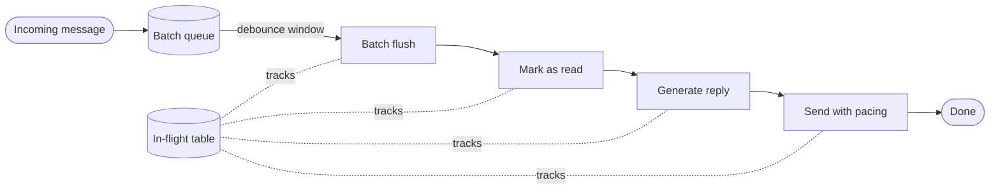

<Note>
This is the architecture we use at Photon to ship agents that **live natively inside IM apps**.

The patterns below are pulled directly from production, based on the problems we encountered and the solutions we built to solve them. They're not theoretical best practices - they're the ones that **worked in the real world, with real users, and real bugs**. If you're building a similar agent, these patterns will save you **months** of trial and error.
</Note>

A naive Spectrum agent - read incoming, call the LLM, send the reply - falls apart in ways you don't see until you ship it. The user types "hey" → "wait" → "actually nvm" inside three seconds and gets three independent responses. The agent replies in 200ms when a real person would take five minutes. A worker crashes mid-send and the user receives the same message twice on retry.

This section captures the patterns that solve those problems, drawn from production agents built on Spectrum.

## The pipeline

Every incoming message flows through five stages backed by a job queue. Each stage is a separately enqueued job, which is what makes any of them cancellable when a follow-up message lands.

The `In-flight` table is a per-chat record of whichever job ID currently owns each stage. When a new message arrives, the enqueuer reads it, cancels those jobs, and moves any messages that were already drained into a carry-forward table so the next batch sees them.

## Why split it up

If you do everything in one handler - read, generate, send - you lose the ability to react to a new message that arrives during generation. By the time you notice, you've already sent a reply that ignored what the user just said, or you've raced the LLM against itself.

Splitting into stages costs a few hundred ms of extra hop latency and buys you:

- **Cancellation points.** Each stage can check a flag and abort cleanly.
- **Resume points.** A worker crash mid-stage retries one stage, not the whole conversation turn.
- **Idempotency seams.** The send stage carries stable client GUIDs so retries don't double-send.
- **Distinct timing.** The read stage can sleep for an hour while the send stage runs in 500ms - they're independent jobs.

## What's in this section

- [Inbound pipeline](/best-practices/inbound-pipeline) - debouncing message bursts, batching, surviving cancellation, and the carry-forward rule that keeps messages from getting lost.
- [Recovery and state](/best-practices/recovery-and-state) - idempotent retries via client GUIDs, per-resource memory scope, and a durable failure audit log.
