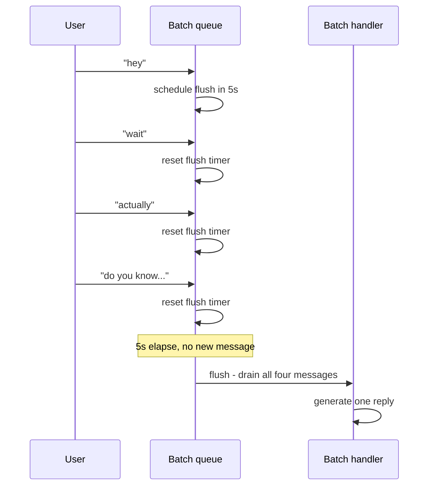
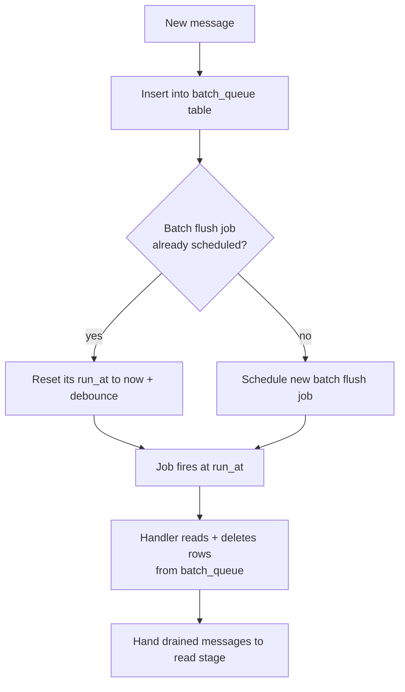
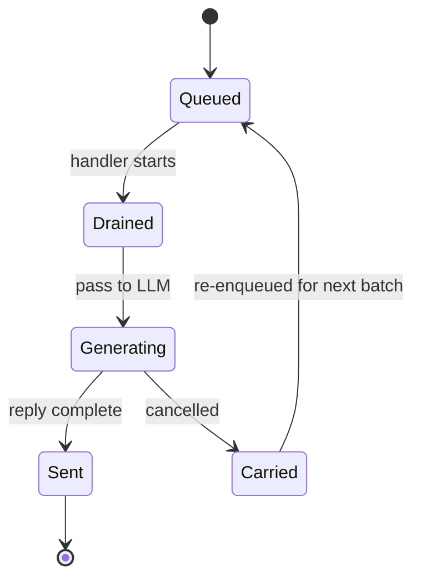

People text in bursts. A real conversation looks like this:

```
hey
wait
actually
do you know if the train runs on holidays
```

Four messages in eight seconds. If your agent fires a generation on each one, you get four overlapping replies - and the model never sees the actual question. The fix is to debounce: wait a few seconds for the burst to settle, and handle whatever has accumulated as one turn.



A few seconds of fixed debounce gets you most of the way there. The harder problems are what happens after the flush.

## Drain in the handler, not the enqueuer

The single most important rule: **the messages stay in the queue table until the handler reads them.** Don't pull them into the job payload at enqueue time.

Why: if the batch-flush job gets cancelled before the handler runs, anything in the payload is lost. Anything still in the queue is naturally picked up by the next batch. Keeping the data in the queue table until the last possible moment makes cancellation a non-event for those messages.



If the flush job is cancelled between steps F and G, the rows stay in `batch_queue` and the next incoming message picks them up.

## Carry-forward

Sometimes the handler does drain the queue but is then cancelled mid-generation. Those messages are now in memory inside a cancelled job - they'd be lost on the floor.

The fix is a `carried_messages` table. When a job is cancelled after draining, write the drained messages there. The next batch's handler reads from `carried_messages` first and prepends them as `[Earlier message] ...` lines so the model sees them as historical context, not as fresh input.



## In-flight cancellation

When a new message arrives and you have a job in flight (reading, generating, or sending), you need to stop it. Two pieces:

1. **A cancellation flag** in a per-chat `in_flight` table. The enqueuer sets `cancelled_at` and calls `boss.cancel(jobId)`.
2. **Polling inside the handler.** The send stage in particular polls `cancelled_at` every 500ms and aborts via an `AbortController`.

The subtle bit: compare `cancelled_at` against the chain's own `chainStartedAt` timestamp, not against "is the flag set." Otherwise a stale flag from a prior cancelled chain orphans the new one. The flag is per-chain, not per-chat.

```ts
const inflight = await readInflight(chatId);
if (inflight?.cancelled_at && inflight.cancelled_at > chainStartedAt) {
  abortController.abort();
}
```

## What you give up

This pipeline buys you correctness at the cost of a few hundred milliseconds of hop latency between stages. For a conversational Spectrum agent that's irrelevant - humans don't notice 300ms when a "real" reply takes 5 seconds anyway. For a low-latency tool integration, you'd consolidate stages.
