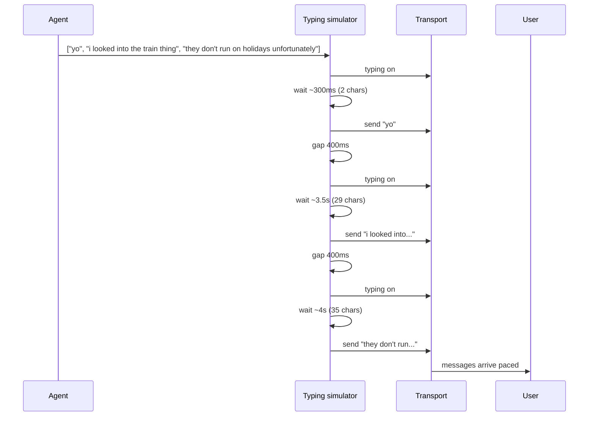

Watch how a friend texts. They don't send one paragraph. They send two short messages, pause, send a third, pause longer, send a follow-up. The shape of the reply is half the signal.

If your agent emits one wall of text, no amount of voice-tuning makes it feel like a person. The fix is to split one logical reply into multiple messages, simulate typing between them, and let the model insert pauses where it wants emphasis.

## Splitting one reply into messages

The model's output is a list of messages, not a string. The simplest format is one message per line:

```
yo
i looked into the train thing
they don't run on holidays unfortunately
sorry
```

Four messages. The send stage iterates and sends them with typing simulation between each.

The model decides where the splits go. Don't try to split server-side from punctuation - you'll get it wrong, and the model is much better at picking natural beats. Just give the prompt examples of multi-message replies.

## Typing simulation

For each outgoing message:

1. Turn on the typing indicator.
2. Wait for a duration proportional to the message length (rough rule: 6–9 characters per second).
3. Send the message.
4. Wait a short inter-message gap (200–600ms).



Per-character pacing handles 90% of cases. The other 10% is when the model wants a pause that _isn't_ proportional to the next message's length - a dramatic beat, a "thinking" gap, a mid-conversation hesitation. Hard-coded pacing can't express that.

## Author-supplied pause overrides

Give the model a token it can emit to override the typing duration of the _next_ message:


| Token | Effect |
|---|---|
| `{{MSG}}` | Auto-computed from message length (default) |
| `{{MSG:0.5}}` | Quick beat - 0.5s typing duration |
| `{{MSG:4}}` | Long pause - 4s before this message lands |

Example output from the model:

```
{{MSG}}
yo
{{MSG}}
i looked into the train thing
{{MSG:3}}
they don't run on holidays unfortunately
{{MSG:0.5}}
sorry
```

The third message gets a 3-second pause to land emphasis on the bad news; the apology fires fast right after. Without override tokens, both would be paced strictly to length and the rhythm would be flat.

The parser strips the token from the message text before sending - the user just sees the message with the right timing.

**Bound the override.** Cap it at 30 seconds. The model occasionally produces `{{MSG:600}}` and you don't want to hang for 10 minutes.


## What about the typing indicator itself

Most platforms have a typing indicator and most bots get it wrong: they turn it on right when the user sends, leave it on the entire time the LLM is generating, and turn it off when the message sends. The user sees "typing... typing... typing..." for 8 seconds and a one-line reply. It's worse than no indicator at all.

Better: only turn on the indicator during the simulated typing window for each chunk. A 30-character message gets ~4s of typing indicator before it lands, then off, then on again for the next chunk. That matches what a human's behavior actually looks like to the recipient.
