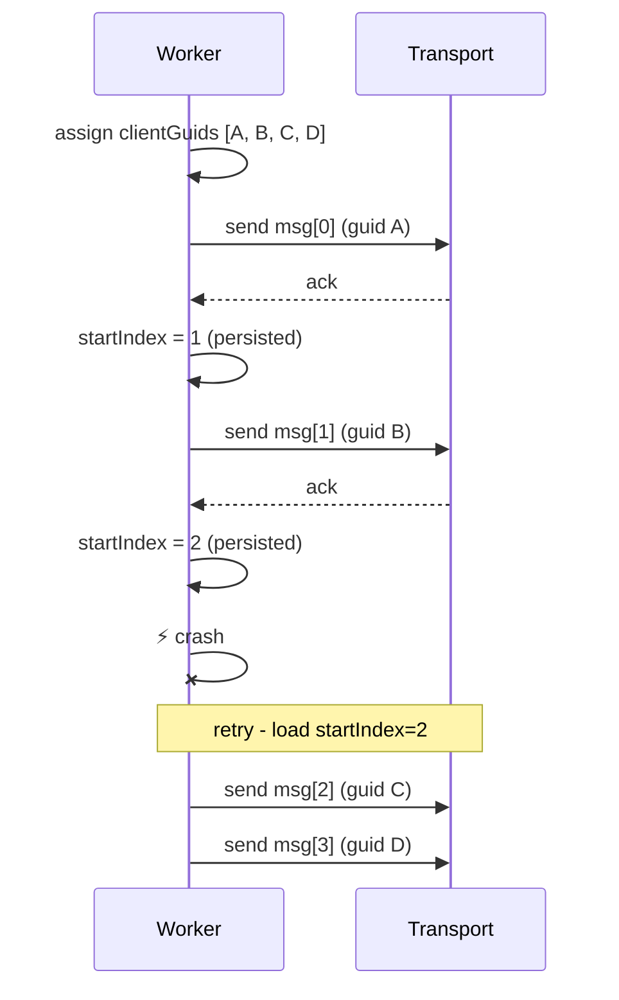
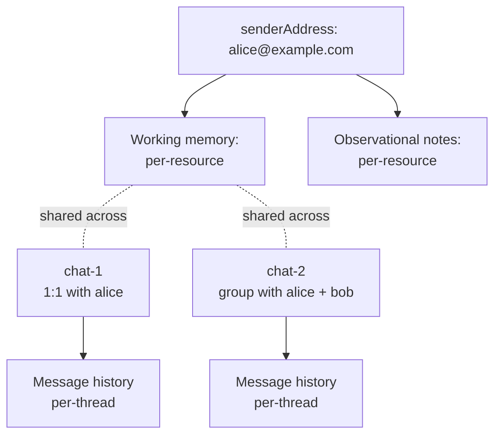
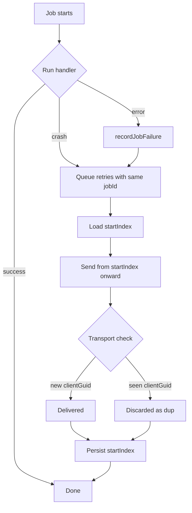

Workers crash. The send job fails halfway through a 4-message reply. The retry runs from the top - and the user gets messages 1 and 2 again, then 3 and 4 for the first time. Now they have a duplicate.

You need three things to make this robust: stable client GUIDs, a resume cursor, and a place to record what failed.

## Stable client GUIDs

Every message you enqueue gets a deterministic identifier - a `clientGuid` - assigned at enqueue time, not at send time. The transport uses it for deduplication: if it sees the same `clientGuid` twice, it discards the second copy.

```ts
const messages = reply.map((text, index) => ({
  text,
  clientGuid: `${jobId}-${index}`, // stable across retries
}));
```

Most modern messaging transports support stable client-side IDs for dedup, and Spectrum surfaces them through the provider interface - check what your provider exposes before assuming you need to build dedup yourself.

The reason `clientGuid` must be stable is subtle: a worker that crashes after the transport ack'd but before the worker recorded it will retry the same message. Without a stable GUID, the transport sees a "new" message and delivers a duplicate.

## startIndex resume cursor

GUID-based dedup handles the "transport already saw this" case. But you also want the worker itself to skip messages it knows it already sent - both for performance and to avoid even attempting the dedup roundtrip.

Persist a `startIndex` on the job. After each successful send, atomically bump it. On retry, resume from there:



If the crash happens _between_ ack and persist, the retry will resend `msg[1]` - but the transport sees the same `clientGuid B` and discards it. Both layers of defense are doing work.

## Per-resource memory scope

A single agent talks to many users. Each one needs their own working memory, conversation history, and observational notes. Mixing them up is catastrophic - the agent telling one user about another user's plans is the kind of bug you see once and never forget.

Scope every memory operation by `resourceId = senderAddress`. The thread ID is per-chat (`chat-${chatId}`), but memory is per-person:

```ts
await memory.getWorkingMemory({
  resourceId: senderAddress,
  threadId: `chat-${chatId}`,
});
```

The same person messaging from a group chat versus a 1:1 sees the same working memory (same `resourceId`), but conversation history is per-thread (different `threadId`). That's usually what you want - the agent remembers _who you are_ across all chats but treats each thread as its own conversation.



If you shard memory across databases or tenants, each shard needs to follow the same convention. Test multi-user concurrency hard - race conditions in working-memory updates corrupt state silently and you won't notice until two users compare notes.

## Job failure audit log

When a job fails, you want to know which job, when, with what payload, and why - without grepping through rotating logs.

A `job_failures` table is a small amount of code that pays back disproportionately. Every error path calls `recordJobFailure(queueName, jobId, payload, error)` and inserts a row. Now you can ask:

- "Which jobs failed in the last hour?"
- "Are all failures coming from one chat?" (a corrupt working-memory state)
- "Are all failures from one queue stage?" (a transport outage vs. an LLM bug)
- "What was the payload that triggered this?" (reproducer)

Couple of operational notes:

- **Add a retention policy.** Otherwise the table grows forever. Delete entries older than 30 days.
- **Make `recordJobFailure` itself fail-safe.** Wrap it in a try/catch with a log fallback - you don't want a failed-failure-record to take down the worker.
- **Be careful with payload size.** If your jobs carry images or large blobs, the audit table balloons. Either truncate the payload or store a pointer to it.

## Putting it together

The crash-recovery story:



Three independent layers - queue retry, resume cursor, transport dedup - and any one of them is enough to prevent a duplicate in most failure modes. Together they survive almost everything short of the database itself going down.
