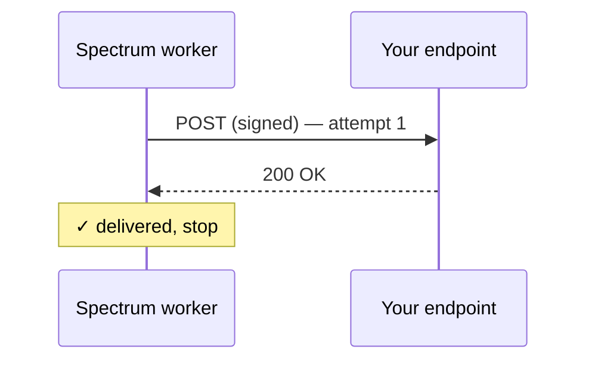
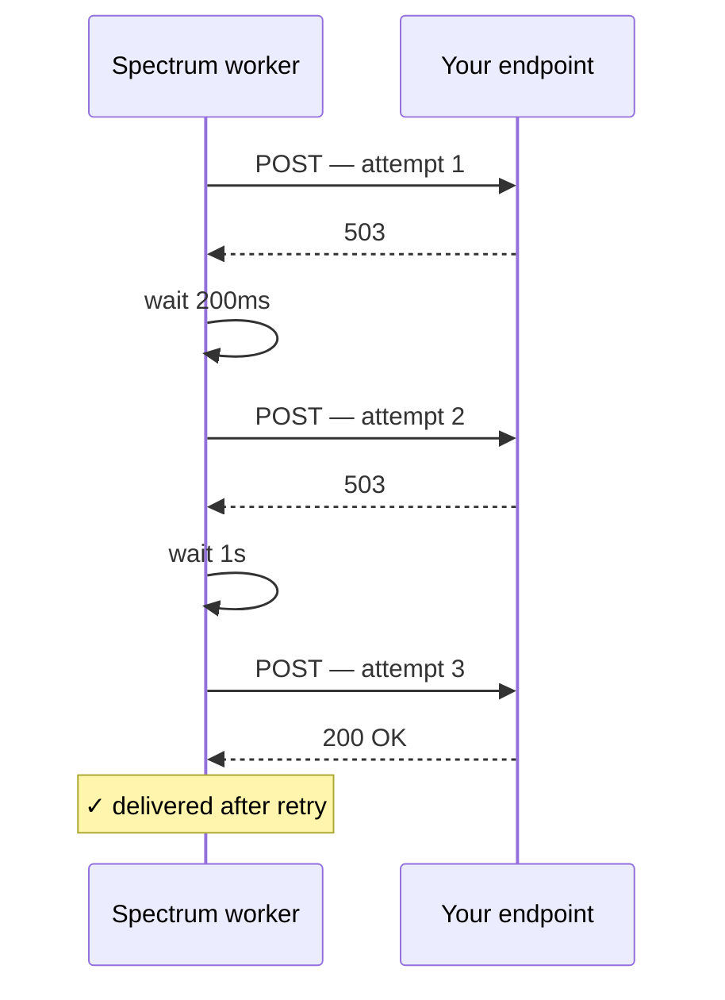

You know what arrives ([Events](/webhooks/events)) and how to prove it's real ([Verifying signatures](/webhooks/verifying-signatures)). This page picks up the moment *after* the worker computes a signature and starts the `POST` to your URL — what it does when your server is fast, slow, broken, or unreachable. The contract is simple but worth knowing exactly, because it determines how fault-tolerant you need to be on your end.

## The contract in one paragraph

Spectrum tries to deliver each event for up to four attempts within a ~6.2 second window. Each attempt has a 10-second per-request timeout. Retries happen on `5xx`, `408`, `429`, network errors, and our own timeouts; other `4xx` codes mean "give up." Successful deliveries acknowledge with any `2xx`. After the budget is exhausted the event is dropped from the worker's memory — there is no durable retry queue. Customers who care about every event must dedupe and tolerate occasional misses.

## What the worker does on each attempt



If the first attempt fails, the worker waits and tries again:



Total wall-clock budget across all attempts: roughly 6.2 seconds (200ms + 1s + 5s of sleeps, plus per-attempt time on the network). The worker stops as soon as it gets a 2xx or determines further retries are pointless.

## Retry policy

| Attempt | Delay before this attempt |
| --- | --- |
| 1 | none — fires immediately |
| 2 | 200ms after attempt 1 ends |
| 3 | 1 second after attempt 2 ends |
| 4 | 5 seconds after attempt 3 ends |

Per-attempt timeout: **10 seconds** (configurable via `DELIVERY_TIMEOUT_MS` on our side, but you should treat 10s as the practical ceiling).

After attempt 4 fails, the event is logged and dropped. There is no persistent queue and no dead-letter destination — both are out of scope for v1.

<Note>
Multiple registered URLs receive the same event in parallel via `Promise.allSettled`. One slow or failing URL never delays delivery to the others.
</Note>

## What your status codes mean to us

| Status code(s) | Worker treats as | Result |
| --- | --- | --- |
| `2xx` | Success | Delivery complete. Stop. |
| `5xx` | Retriable | Wait, retry up to 3 more times. |
| `408 Request Timeout` | Retriable | Wait, retry. |
| `429 Too Many Requests` | Retriable | Wait, retry. We don't honor `Retry-After` yet — use any 5xx/429 to backpressure. |
| Any other `4xx` (e.g. `400`, `401`, `403`, `404`, `422`) | Fatal | Don't retry. The assumption is that the request will never succeed (auth bug, schema mismatch, missing route). |
| Connection refused / DNS error / TCP reset | Retriable | Wait, retry. |
| Per-attempt timeout (>10s) | Retriable | Wait, retry. |

<Tip>
**Return `4xx` deliberately.** Returning `400` or `401` from a real bug (e.g. signature verification failure) is correct — it tells us "stop retrying, this request will never work." Returning `500` for the same bug wastes our retry budget and your CPU cycles.
</Tip>

## What you should do on your end

### Acknowledge fast, process asynchronously

Return `2xx` as soon as you've **verified the signature and queued the work**. Do not block the response on slow downstream operations (LLM calls, third-party APIs, large database writes).

```ts
app.post('/spectrum-webhook', async (c) => {
  if (!verify(c)) return c.text('bad signature', 401);

  const payload = JSON.parse(await c.req.text());
  void enqueueForProcessing(payload);

  return c.text('ok', 200);
});
```

If your handler takes >10 seconds, the worker will time out the connection, mark it retriable, and `POST` again. Now you'll process the same event twice.

### Be idempotent

At-least-once delivery means the same event can arrive more than once if your server hung after processing but before responding. Dedupe in your handler:

```ts
const dedupeKey = `${webhookId}:${payload.message.id}`;

if (await alreadyProcessed(dedupeKey)) {
  return c.text('ok', 200);
}

await processOnce(payload);
await markProcessed(dedupeKey);
```

A short TTL (24-48 hours) on the dedupe table is enough — by then the worker has long since moved on.

### Handle bursts

A noisy chat (group thread, mass DM) can produce many events per second. Make sure your handler can either:

- Process events at the rate they arrive, or
- Queue them durably (BullMQ, SQS, Postgres-backed queue, anything) and return `2xx` immediately.

Returning `503` on overload is fine — we'll back off and retry. But it eats into your retry budget; queueing is preferable.

## Failure modes and what they cost you

| Scenario | Outcome |
| --- | --- |
| Endpoint returns `2xx` on first try | Best case. One delivery, one process. |
| Endpoint returns `503`, recovers within 6s | Retried, eventually delivered. One process (assuming no `2xx` on the failed attempt). |
| Endpoint times out after 10s, then succeeds | Retried, eventually delivered. **Possibly processed twice** — your handler ran during the timeout and again on retry. Dedupe required. |
| Endpoint returns `400` (signature bug, etc.) | Dropped immediately, no retry. Event lost. Logged on our side. |
| Endpoint down for >6 seconds | Dropped after 4 attempts. Event lost. |
| Spectrum worker crashes mid-delivery | Event lost — no durable queue. Subsequent events resume after restart. |

The "event lost" rows are why this is **at-least-once, with bounded retries**, not "guaranteed delivery." If your use case requires zero loss (financial transactions, audit logging), pair webhooks with periodic reconciliation against the [Spectrum API](/api-reference/introduction) — list messages on the space and backfill anything you missed.

## Order and parallelism

- **No global ordering guarantee.** Events from different projects, different spaces, or different platforms can arrive in any order.
- **No per-space ordering guarantee.** A late retry for an earlier message can land after a successfully-delivered later message.
- **Parallel deliveries to multiple URLs.** If you have multiple webhooks registered, they receive each event in parallel and may finish in any order.

If your handler depends on order, sort by `message.timestamp` (which is the platform's send time, not the delivery time) and rely on dedupe to handle late arrivals.

## What we *don't* deliver

- **Outbound messages.** A message you send via the API does not echo back as a webhook.
- **Read receipts, typing indicators, reactions.** Coming as separate event types in future versions — they are not in `messages` payloads today.
- **Acknowledgements that you processed correctly.** Returning `2xx` only tells us the delivery succeeded; we don't track downstream state.

## When to use the SDK loop instead

If you find yourself working hard to compensate for delivery loss, consider running [`spectrum-ts`](/spectrum-ts/getting-started) directly instead of (or in addition to) webhooks. The SDK's `instance.messages` async iterable is a long-lived stream — slower events can't be lost to a delivery timeout because there is no delivery, just a `for await` loop running in your process.

A common pattern: webhooks for low-latency push, and a periodic reconciliation worker that uses the SDK or API to backfill anything the webhook layer missed.

## Where to next

With the contract clear, the remaining pages are operational. The next chapter is the day-to-day: managing the webhooks themselves.

<Columns cols={2}>
  <Card title="Managing webhooks" icon="gear" href="/webhooks/managing-webhooks">
    Register, list, delete, and rotate signing secrets — each one testable in the [interactive API reference](/api-reference/introduction).
  </Card>
  <Card title="Troubleshooting" icon="bug" href="/webhooks/troubleshooting">
    Common signature errors, missed deliveries, duplicates, and how to debug them.
  </Card>
</Columns>
