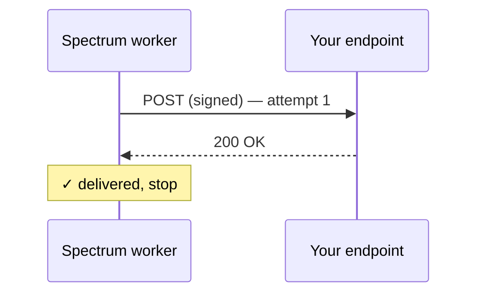
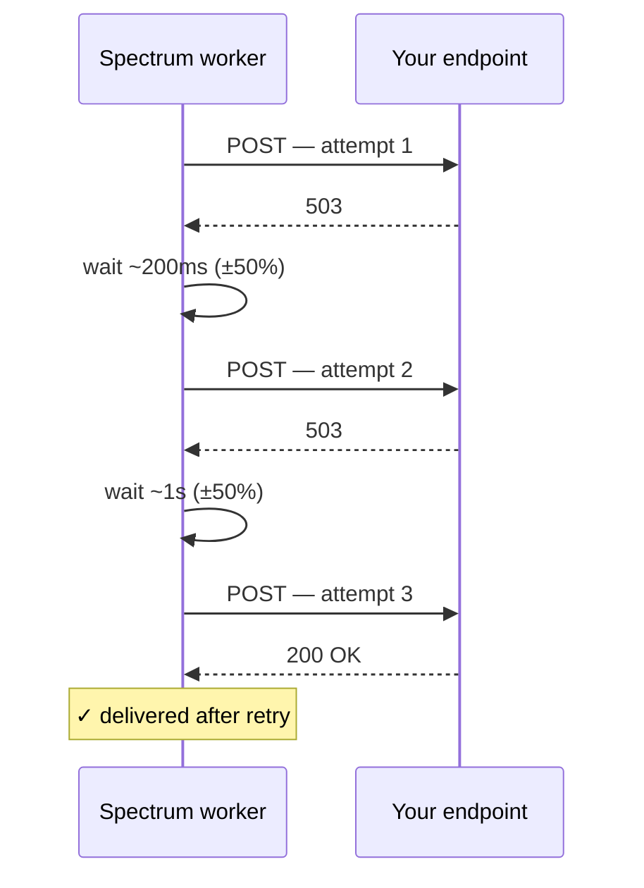

You know what arrives ([Events](/webhooks/events)) and how to prove it's real ([Verifying signatures](/webhooks/verifying-signatures)). This page picks up the moment *after* the worker computes a signature and starts the `POST` to your URL — what it does when your server is fast, slow, broken, or unreachable. The contract is simple but worth knowing exactly, because it determines how fault-tolerant you need to be on your end.

## The contract at a glance

- **Strong retry behaviour.** Up to 6 attempts per event by default, with exponential backoff plus jitter on `5xx`, `408`, `429`, network errors, and worker-side timeouts. The vast majority of deliveries land on attempt 1; the retries are there for the occasional bad minute on your side.
- **Fast acknowledgement.** Any `2xx` ends it — the worker stops as soon as your server says ok.
- **Fast permanent failure.** Other `4xx` codes (`400`/`401`/`404`/etc.) are treated as fatal — we don't waste your retry budget when the request will never succeed.
- **Bounded budget.** 30-second per-attempt timeout, with up to ~39 seconds of backoff sleeps between attempts (jittered). If your server is still down after the final attempt, the event is logged and the worker moves on — there is no dead-letter queue today.
- **At-least-once delivery.** A retry after your server timed out can re-deliver an event you already processed — always dedupe in your handler (see [Be idempotent](#be-idempotent) below).
- **URL guard, fail-closed.** Before every attempt the worker validates the target URL: it must be `https://`, must resolve to a public address, and must not redirect. A URL that fails the check is dropped immediately — fatal, no retry — see [Where we won't deliver](#where-we-wont-deliver) below.

This is a bounded-retry contract, not zero-loss delivery. If your use case requires *every* event regardless of downtime (financial audit, transactional state machines), pair webhooks with periodic reconciliation against the [Spectrum API](/api-reference/introduction) — covered later on this page.

## What the worker does on each attempt



If the first attempt fails, the worker waits and tries again:



The backoff *sleeps* sum to ~26.2 seconds in the average case (200ms + 1s + 5s + 10s + 10s) and ~39.3 seconds in the worst case (jitter ceiling). Wall-clock time also includes per-attempt network time, bounded by the 30-second per-attempt timeout: a healthy delivery finishes in milliseconds, while a worst case where every attempt hangs to the timeout can run up to ~3.5 minutes before the worker gives up. It stops as soon as it gets a 2xx or determines further retries are pointless.

## Retry policy

Retries follow an exponential-backoff schedule with ±50% jitter applied to every delay. The formula is the canonical [full-jitter pattern](https://aws.amazon.com/blogs/architecture/exponential-backoff-and-jitter/) — the *expected* delay is the value in the table below, while the *actual* delay is drawn uniformly from the jitter window so coordinated retries don't pile onto your endpoint at the same instant after a recovery.

| Attempt | Expected delay before this attempt | Actual jittered range |
| --- | --- | --- |
| 1 | none — fires immediately | — |
| 2 | 200ms after attempt 1 ends | `[100ms, 300ms)` |
| 3 | 1 second after attempt 2 ends | `[500ms, 1500ms)` |
| 4 | 5 seconds after attempt 3 ends | `[2.5s, 7.5s)` |
| 5 | 10 seconds after attempt 4 ends (clamped from a formula value of 25s by the per-attempt cap) | `[5s, 15s)` |
| 6 | 10 seconds after attempt 5 ends (clamped from a formula value of 125s by the per-attempt cap) | `[5s, 15s)` |

Per-attempt timeout: **30 seconds**. Treat it as a hard ceiling, not a target — acknowledge in well under a second and push slow work off the response path (see [Acknowledge fast](#acknowledge-fast-process-asynchronously) below).

After attempt 6 fails, the event is logged and dropped. There is no persistent queue and no dead-letter destination — both are out of scope for v1.

<Note>
Multiple registered URLs receive the same event in parallel via `Promise.allSettled`. One slow or failing URL never delays delivery to the others.
</Note>

### Why jitter matters

A naive deterministic schedule (`200ms, 1s, 5s, 10s, 10s` to the millisecond) means that when *every* project's deliveries flap at once — a rolling deploy on your side, a regional DB failover, a noisy upstream — every retry across every project queues at exactly the same offsets and lands on your first healthy moment as a coordinated herd. Jitter spreads each scheduled delay across a window twice as wide as the expected value, so the retry volume smears out and your connection pool / WAF / autoscaler get room to absorb the load gracefully.

### Tunable on our side

The retry schedule is operator-configurable. The Photon team can adjust these knobs per environment to trade latency for durability — useful, for example, if a regulated workload needs to tolerate a longer outage than the default ~30s budget covers. The full set:

| Knob | Default | Effect |
| --- | --- | --- |
| Initial delay | 200ms | The `i = 0` term — delay before the first retry. |
| Growth factor | 5× | Multiplier applied per retry index (`200ms → 1s → 5s → ...`). |
| Per-attempt cap | 10 seconds | Ceiling applied to every computed delay before jitter, so the curve can't run away. |
| Total attempts | 6 (initial + 5 retries) | Higher values trade wall-clock latency for more retries against a flaky endpoint. |

These are *internal* env vars on the spectrum-webhook worker — customers can't set them per-webhook today. If you have a use case that needs different retry behaviour (more retries, longer ceiling), reach out and we'll discuss tuning the deployment-wide defaults or adding a per-project override. Open an issue on the [docs repo](https://github.com/photon-hq/docs) or message us in the [Discord](https://discord.gg/4c3VJzDfNA).

<Tip>
If you're seeing duplicates after long handler waits — say, attempt 1 takes 28 seconds and succeeds on your side, but our retry layer doesn't see the response in time — that's the per-attempt timeout, not the retry schedule. Tighten your handler (acknowledge first, process later) before asking us to widen our budget.
</Tip>

## What your status codes mean to us

| Status code(s) | Worker treats as | Result |
| --- | --- | --- |
| `2xx` | Success | Delivery complete. Stop. |
| `3xx` (redirect) | Fatal | We send with `redirect: "manual"` and never follow. Register the endpoint's final URL directly. See [Where we won't deliver](#where-we-wont-deliver). |
| `5xx` | Retriable | Wait, retry up to 5 more times. |
| `408 Request Timeout` | Retriable | Wait, retry. |
| `429 Too Many Requests` | Retriable | Wait, retry. We don't honor `Retry-After` yet — use any 5xx/429 to backpressure. |
| Any other `4xx` (e.g. `400`, `401`, `403`, `404`, `422`) | Fatal | Don't retry. The assumption is that the request will never succeed (auth bug, schema mismatch, missing route). |
| Connection refused / TCP reset (after the URL guard passes) | Retriable | Wait, retry. |
| Hostname doesn't resolve (DNS failure) | Fatal | Caught by the URL guard *before* the request — fail-closed, no retry. |
| Per-attempt timeout (>30s) | Retriable | Wait, retry. |

<Tip>
**Return `4xx` deliberately.** Returning `400` or `401` from a real bug (e.g. signature verification failure) is correct — it tells us "stop retrying, this request will never work." Returning `500` for the same bug wastes our retry budget and your CPU cycles.
</Tip>

## Where we won't deliver

Before each attempt the worker validates the destination URL and **fails closed** — if a URL can't be confirmed safe, the delivery is dropped (fatal, no retry) rather than sent. Three rules:

- **HTTPS only.** Plain `http://` URLs are rejected. Deliveries carry message content and a signature; we won't put either on the wire in plaintext.
- **Public addresses only.** The hostname must resolve to a public IP. URLs that resolve to loopback (`localhost`, `127.0.0.1`), private networks (`10.x`, `172.16–31.x`, `192.168.x`), or link-local / cloud-metadata addresses (`169.254.169.254` and friends) are blocked. This is SSRF protection — it stops a registered webhook from being turned into a probe against internal services. IPv6 loopback, link-local, and unique-local ranges are blocked the same way.
- **No redirects.** The worker sends with `redirect: "manual"` and never follows a `3xx`. An endpoint that 301/302s — a trailing-slash redirect, an `http`→`https` bounce, a load-balancer redirect — is treated as a fatal misconfiguration. Register the final URL directly.

A malformed URL or a DNS lookup that fails counts as "can't confirm safe" and is dropped the same way.

<Warning>
These checks run at **delivery** time, not registration. A URL that violates them still registers successfully — registration only validates URL *syntax* — but then **silently drops every event**, logged as a fatal delivery on our side and invisible on yours. If a freshly-registered webhook never fires, this is the first thing to check: see [Troubleshooting → Every delivery is dropped immediately](/webhooks/troubleshooting#every-delivery-is-dropped-immediately).
</Warning>

## What you should do on your end

### Acknowledge fast, process asynchronously

Return `2xx` as soon as you've **verified the signature and queued the work**. Do not block the response on slow downstream operations (LLM calls, third-party APIs, large database writes).

```ts
app.post('/spectrum-webhook', async (c) => {
  if (!verify(c)) return c.text('bad signature', 401);

  const payload = JSON.parse(await c.req.text());
  void enqueueForProcessing(payload);

  return c.text('ok', 200);
});
```

If your handler takes >30 seconds, the worker will time out the connection, mark it retriable, and `POST` again. Now you'll process the same event twice.

### Be idempotent

At-least-once delivery means the same event can arrive more than once if your server hung after processing but before responding. Dedupe in your handler using a composite of the `X-Spectrum-Webhook-Id` header (the webhook config ID) and an event-scoped identifier from the payload — e.g. `payload.message.id` for the `messages` event:

```ts
const dedupeKey = `${webhookId}:${payload.message.id}`;

if (await alreadyProcessed(dedupeKey)) {
  return c.text('ok', 200);
}

await processOnce(payload);
await markProcessed(dedupeKey);
```

A short TTL (24-48 hours) on the dedupe table is enough — the retry budget is bounded to a few minutes even with jitter and per-attempt timeouts, so anything we'd re-deliver lands well inside that window.

### Handle bursts

A noisy chat (group thread, mass DM) can produce many events per second. Make sure your handler can either:

- Process events at the rate they arrive, or
- Queue them durably (BullMQ, SQS, Postgres-backed queue, anything) and return `2xx` immediately.

Returning `503` on overload is fine — we'll back off and retry. But it eats into your retry budget; queueing is preferable.

## Failure modes and what they cost you

| Scenario | Outcome |
| --- | --- |
| Endpoint returns `2xx` on first try | Best case. One delivery, one process. |
| Endpoint returns `503`, recovers within ~30s | Retried, eventually delivered. One process (assuming no `2xx` on the failed attempt). |
| Endpoint times out after 30s, then succeeds | Retried, eventually delivered. **Possibly processed twice** — your handler ran during the timeout and again on retry. Dedupe required. |
| Endpoint returns `400` (signature bug, etc.) | Dropped immediately, no retry. Event lost. Logged on our side. |
| Webhook URL is `http://` (not HTTPS) | Dropped immediately by the URL guard, no retry. Every event lost until you re-register an `https://` URL. |
| Webhook URL resolves to a private/internal IP | Dropped immediately, no retry (SSRF guard). Logged. |
| Endpoint responds with a `3xx` redirect | Dropped immediately, no retry. Register the final URL instead. |
| Endpoint down for the full retry window (~30s default, more if you've requested tuning) | Dropped after the final attempt. Event lost — no DLQ today. |
| Spectrum worker crashes mid-delivery | Event lost — no durable queue. Subsequent events resume after restart. |

The "event lost" rows are why this is **at-least-once, with bounded retries**, not "guaranteed delivery." If your use case requires zero loss (financial transactions, audit logging), pair webhooks with periodic reconciliation against the [Spectrum API](/api-reference/introduction) — list messages on the space and backfill anything you missed.

## Order and parallelism

- **No global ordering guarantee.** Events from different projects, different spaces, or different platforms can arrive in any order.
- **No per-space ordering guarantee.** A late retry for an earlier message can land after a successfully-delivered later message.
- **Parallel deliveries to multiple URLs.** If you have multiple webhooks registered, they receive each event in parallel and may finish in any order.

If your handler depends on order, sort by `message.timestamp` (which is the platform's send time, not the delivery time) and rely on dedupe to handle late arrivals.

## What we *don't* deliver

- **Outbound messages.** A message you send via the API does not echo back as a webhook.
- **Standalone reaction events.** Reactions arrive *today* as a `content.type` arm inside the `messages` payload, not as a separate top-level event — branch on `content.type`. Typing indicators, edits, poll votes, and read receipts aren't delivered in any form yet.
- **Acknowledgements that you processed correctly.** Returning `2xx` only tells us the delivery succeeded; we don't track downstream state.

## When to use the SDK loop instead

If you find yourself working hard to compensate for delivery loss, consider running [`spectrum-ts`](/spectrum-ts/getting-started) directly instead of (or in addition to) webhooks. The SDK's `instance.messages` async iterable is a long-lived stream — slower events can't be lost to a delivery timeout because there is no delivery, just a `for await` loop running in your process.

A common pattern: webhooks for low-latency push, and a periodic reconciliation worker that uses the SDK or API to backfill anything the webhook layer missed.

## Where to next

With the contract clear, the remaining pages are operational. The next chapter is the day-to-day: managing the webhooks themselves.

<Columns cols={2}>
  <Card title="Managing webhooks" icon="gear" href="/webhooks/managing-webhooks">
    Register, list, delete, and rotate signing secrets — each one available in the [API reference](/api-reference/introduction).
  </Card>
  <Card title="Troubleshooting" icon="bug" href="/webhooks/troubleshooting">
    Common signature errors, missed deliveries, duplicates, and how to debug them.
  </Card>
</Columns>
