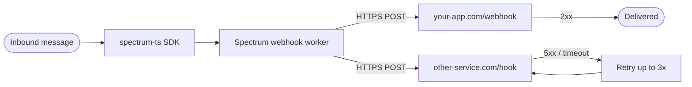

## What is a webhook?

A webhook is the inverse of a normal API call.

In a normal API call, your code reaches out and asks a service for data — you poll, you wait, you parse the response. In a *web*hook, the service reaches out to *you*: a message arrives, an event fires, and the service `POST`s the details to a URL you've published. You're not asking anymore; you're being told.

For Spectrum, that means you write a regular HTTP *handler* — a function in your server that runs whenever a request comes in — and register its URL with us once. From then on, every inbound message across every enabled platform is delivered to that URL as a signed JSON `POST`. No long-lived process to babysit, no platform credentials in your runtime, no reconnect logic.

```ts
const app = await Spectrum({ projectId, projectSecret, providers: [imessage.config()] });
// Without webhooks, you'd run this loop yourself, forever.
for await (const [space, message] of app.messages) { /* ... */ }
```

```http
# With webhooks, Spectrum runs the loop and POSTs each message to you.
POST https://your-app.com/spectrum-webhook
X-Spectrum-Event: messages
X-Spectrum-Event-Id: spc-msg-...
X-Spectrum-Signature: v0=<hmac>
X-Spectrum-Timestamp: 1747242392

{"event":"messages","space":{...},"message":{...}}
```

Spectrum handles staying connected to every [supported platform](/spectrum-ts/providers), batching, reconnects, and signing. You handle the HTTP request that lands at your door.

## How this guide flows

The next six pages build on each other. Skim straight to the topic you need, or read top-to-bottom in about fifteen minutes for the complete model.

1. **[Quickstart](/webhooks/quickstart)** — register a URL, verify a signature, and receive your first real delivery in five minutes.
2. **[Events](/webhooks/events)** — the exact wire format, every header and every field, with real examples.
3. **[Verifying signatures](/webhooks/verifying-signatures)** — why the verifier looks the way it does, with copy-paste code in four languages.
4. **[Delivery and retries](/webhooks/delivery)** — what happens when your endpoint is slow, down, or returns an unexpected status code.
5. **[Managing webhooks](/webhooks/managing-webhooks)** — operate at scale: register, list, delete, and rotate signing secrets via the API or the dashboard.
6. **[Troubleshooting](/webhooks/troubleshooting)** — common symptoms, root causes, and fixes when something goes wrong.

## Three ways to manage webhooks

Three surfaces expose the same three operations (register, list, delete):
 
- **[Dashboard](https://app.photon.codes/dashboard).** UI under the **Webhook** tab of your workspace. No terminal or auth headers required — appropriate for non-technical teammates.
- **[API reference](/api-reference/introduction).** OpenAPI schemas for `List webhooks`, `Register webhook`, and `Delete webhook`. Mintlify also renders the page as a runnable browser playground for live testing.
- **`curl` or any HTTP client.** The terminal flow used in the [Quickstart](/webhooks/quickstart) and the rest of this guide. Scriptable and CI-friendly — the right surface for code generation and automation.

## When to use webhooks

Reach for webhooks when any of these are true:

- **Your service is HTTP-shaped already.** A Node/Bun/Python/Go backend with an inbound endpoint is a one-line addition for webhooks; running a long-lived `Spectrum()` loop is more friction.
- **You don't want to host the SDK.** No `Spectrum()` process, no platform credentials in your runtime, no reconnect logic.
- **You want to fan out one message to multiple services.** Register multiple webhook URLs per project — each one receives every event, independently.
- **You're integrating from a serverless platform** (Vercel, Cloudflare Workers, Lambda) where a long-lived process isn't an option.

Stick with the [`spectrum-ts` SDK loop](/spectrum-ts/getting-started) when you need outbound message control inside the same process that consumes inbound, or when you're iterating fast in dev without a deployable URL.

## How it works



When a message arrives on any enabled platform for a project that has webhooks registered:

1. Our worker receives the message from the platform.
2. It serializes the event to JSON.
3. For every URL registered on that project, it computes an HMAC-SHA256 signature and POSTs the body.
4. Your server verifies the signature, returns `2xx`, and processes the event.

Failed deliveries are retried for a few seconds with exponential backoff, then dropped. There is no persistent retry queue or dead-letter destination — see [Delivery and retries](/webhooks/delivery) for the precise policy.

<Note>
Your webhook URL must be a public **HTTPS** endpoint. The worker won't deliver to plain `http://`, to private/internal addresses (`localhost`, `10.x`, cloud-metadata IPs), or through a redirect — see [Delivery → Where we won't deliver](/webhooks/delivery#where-we-wont-deliver).
</Note>

## The mental model

Four ideas cover everything else in these docs:

| Concept | What it means |
| --- | --- |
| **Per-project, per-URL** | Webhooks are owned by a project. A project can have many URLs; each URL is independent. |
| **Per-URL signing secret** | Every webhook gets its own 64-character signing secret, returned exactly once at registration time. Different URLs, different secrets. |
| **Every URL gets every event** | There is no per-webhook event subscription today. You branch on the `event` field (or `X-Spectrum-Event` header) in your handler. |
| **At-least-once delivery, in-order per project** | A delivery may arrive twice on retry. Dedupe on `webhookId + message.id`. There is no `Exactly-Once` guarantee. |

## Currently emitted events

Today there is one event: **`messages`**. Each delivery carries `X-Spectrum-Event: messages` and a body of shape `{ event, space, message }` — see [Events](/webhooks/events) for every field.

The set will grow (reactions, typing indicators, custom provider events). New event types are additive: existing handlers that ignore unknown values keep working without changes.

## Security in one paragraph

Each delivery includes an `X-Spectrum-Signature` header containing an HMAC-SHA256 of the request body, keyed by your per-webhook signing secret. Anyone can `POST` to your URL — only Spectrum can compute a signature that verifies. Recompute it on your side and reject anything that doesn't match. The full walkthrough, with copy-pasteable code in four languages, is on [Verifying signatures](/webhooks/verifying-signatures).

<Warning>
Your signing secret is returned exactly once, in the response of `POST /webhooks/`. There is no "show me my secret" endpoint. Store it in your secret manager immediately. If you lose it, delete the webhook and re-register the URL — you'll get a new id and a new secret.
</Warning>

## Where to next

<Columns cols={2}>
  <Card title="Quickstart" icon="rocket" href="/webhooks/quickstart">
    Wire up a URL, verify a signature, and receive a real message end-to-end in roughly five minutes.
  </Card>
  <Card title="How it works" icon="diagram-project" href="#how-it-works">
    The mechanics of delivery — useful as a mental model before reading the implementation pages.
  </Card>
</Columns>
