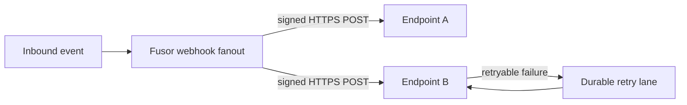

Spectrum sends inbound messaging events to your server as signed HTTPS `POST`
requests. The default Fusor delivery mode follows the
[Standard Webhooks specification](https://github.com/standard-webhooks/standard-webhooks/blob/main/spec/standard-webhooks.md)
and keeps the legacy `X-Spectrum-*` headers during migration.

## How delivery works


```mermaid
flowchart LR
  Event[Inbound event] --> Fanout[Fusor webhook fanout]
  Fanout -->|signed HTTPS POST| A[Endpoint A]
  Fanout -->|signed HTTPS POST| B[Endpoint B]
  B -->|retryable failure| Retry[Durable retry lane]
  Retry --> B
```

You can register multiple endpoints for one project. Each endpoint has its own
secret, subscriptions, retry lane, delivery history, and enabled state. A slow
or failing endpoint does not block another endpoint.

## Standard Webhooks contract

Every default-mode delivery includes:

| Header | Purpose |
| --- | --- |
| `webhook-id` | Stable event id. Use it as your idempotency key. |
| `webhook-timestamp` | UNIX timestamp used by the signature. |
| `webhook-signature` | One or more space-delimited `v1,<base64>` signatures. |
| `Content-Type` | Always `application/json`. |

The JSON body includes the recommended `type` and `timestamp` fields. Spectrum
uses the Standard Webhooks convention that event data can be squashed into the
top-level object, so the existing event fields remain directly accessible.

```json
{
  "type": "message.received",
  "timestamp": "2026-08-03T20:15:30.123Z",
  "schemaVersion": 1,
  "eventId": "0198...",
  "projectId": "2c8f...",
  "platform": "slack",
  "request": {
    "method": "POST",
    "path": "/events",
    "headers": { "content-type": "application/json" },
    "bodyEncoding": "json",
    "body": { "message": "hello" },
    "rawBodyBase64": "eyJtZXNzYWdlIjoiaGVsbG8ifQ=="
  }
}
```

See [Events](/webhooks/events) for the complete field reference.

## Delivery guarantees

- Delivery is **at least once**. Store `webhook-id` before doing non-idempotent
  work.
- Spectrum preserves order for one project, platform, and endpoint.
- Retryable failures enter a durable, endpoint-isolated retry lane for up to
  four days.
- A `410 Gone` response disables the endpoint immediately.
- An endpoint that fails throughout the retry window is disabled. If you set a
  failure-notification email, Spectrum sends a notification.
- Terminal delivery history is available for seven days. Failed events that
  remain in source retention can be replayed manually.

See [Delivery and retries](/webhooks/delivery) for status-code handling and
timeouts.

## Event subscriptions

`message.received` is the event type currently available. New endpoints
subscribe to it by default. You can set `eventTypes` per endpoint so future
event types do not have to be delivered everywhere.

## Security

- Register only public HTTPS URLs. Spectrum rejects redirects and private,
  loopback, link-local, and cloud-metadata destinations.
- Verify the signature against the exact request bytes before parsing JSON.
- Reject stale timestamps and deduplicate by `webhook-id`.
- Rotate the Standard secret with an overlap window. During the overlap,
  `webhook-signature` contains signatures for both keys.
- If your firewall uses an allowlist, retrieve the current stable egress
  addresses from `GET /projects/{projectId}/webhooks/egress-ips`.

The legacy `X-Spectrum-Signature`, `X-Spectrum-Timestamp`, and
`X-Spectrum-Webhook-Id` headers remain present for existing consumers. New
integrations should use the Standard headers and the returned `whsec_` secret.

## Where to next

<Columns cols={2}>
  <Card title="Quickstart" icon="rocket" href="/webhooks/quickstart">
    Register an endpoint and verify your first delivery.
  </Card>
  <Card title="Verifying signatures" icon="shield-halved" href="/webhooks/verifying-signatures">
    Implement raw-body verification and safe key rotation.
  </Card>
  <Card title="Delivery and retries" icon="repeat" href="/webhooks/delivery">
    Understand retries, disabling, history, and replay.
  </Card>
  <Card title="Managing webhooks" icon="gear" href="/webhooks/managing-webhooks">
    Configure subscriptions, notifications, secrets, and endpoints.
  </Card>
</Columns>
